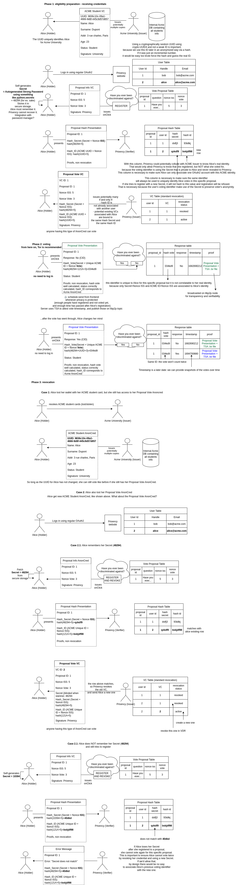

# PoC to prove how to use VerifiableCredentials for counting votes

## How does it work?

## Open questions

On the AnonCred flow:

- as a verifier, how to request the presentation of a _hash_ of a value from an existing AnonCred?
- as of the Secret, can I use the link_secret directly? If yes, how to backup its value?
- as of the Secret, if I can't use the link_secret, how to blind-sign it, like it's done with link_secret? Is there any easy way to do it in Findy?
- when the hash secret is verified, how to issue an AnonCred that contains a Secret that must hash to the same value that was previously presented? I know [Coconut](https://nymtech.net/docs/coconut.html) solves this. Is there a built-in solution in existing Aries frameworks?
- we need to backup the Voting AnonCred in multiple wallets. ZKorum only allows one AnonCred to be issued, so to use it on multiple devices, we need to sync it between them. I bet Findy already does that using webauthn+FIDO2 under the hood?

On the use of Ledgers:

- as an issuer, ZKorum does not really need to use any Ledger. `did:web` is just fine for our use-case. But where to store the schemas? Is it possible to use the existing web infrastructure for publishing AnonCred schemas and handling revokation? I think so, but I havne't found any implementation so far...
