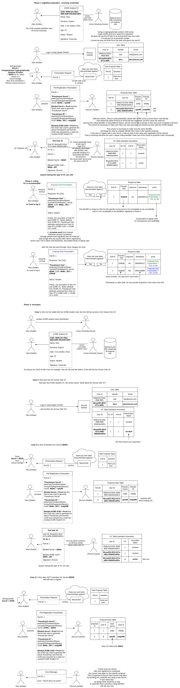

# PoC to prove how to use Verifiable Credentials (VC) for counting votes

## How does it work?

## Low-level implementation

The functionality has been implemented in the Dock [crypto-wasm-ts](https://github.com/docknetwork/crypto-wasm-ts) library:

- this [unit test](https://github.com/docknetwork/crypto-wasm-ts/blob/master/tests/composite-proofs/msg-js-obj/blind-sig-with-attribute-equality-and-pseudonym.spec.ts) showcases the protocol (except for "Pseudonym Secret" - but it is easy to improve it).
- [this PR](https://github.com/docknetwork/crypto-wasm-ts/pull/19) contains an interesting conversation for a background on the why and the how

## More resources

This was the first theoretical draft of the protocol.

Since then, the protocol has been implemented and used within an MVP used by 200+ users, see "front", "back" and "shared" services of https://github.com/zkorum/zkorum/tree/main/services

A more comprehensive explanation is available here: https://ssimeetup.org/zkorum-building-next-generation-eagora-powered-ssi-webinar-70-nicolas-gimenez/
